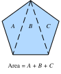

# Calculus
:label:`sec_calculus`

At least 2,500 years ago, ancient Greeks knew how to find the area of a polygon:
divide the polygon into triangles,
then sum the areas of these triangles. 
:numref:`fig_polygon_area` illustrates this Greek method.

:label:`fig_polygon_area`

To find the area of curved shapes, such as a circle,
ancient Greeks inscribed polygons in such shapes.
As shown in :numref:`fig_polygon_area`,
an inscribed polygon with more sides better approximates
the circle.

:label:`fig_polygon_area`

The process in :numref:`fig_polygon_area`
is called *method of exhaustion*.
This is where *integral calculus* originates from.
More than 2,000 years later, 
the other branch of calculus, *differential calculus*,
was invented.
Among the most critical applications of differential calculus,
optimization problems consider how to do something *the best*.
As discussed in :numref:`subsec_norms_and_objectives`,
such problems are ubiquitous in deep learning.
To help you understand
optimization problems and methods in later chapters,
here we give a very brief primer on key concepts
of differential calculus.

## Derivatives and Differentials

Assume the input and output of function $f: \mathbb{R} \rightarrow \mathbb{R}$ are both scalars. The derivative $f$ is defined as

$$f'(x) = \lim_{h \rightarrow 0} \frac{f(x+h) - f(x)}{h},$$

when the limit exists (and $f$ is said to be differentiable). Given $y = f(x)$, where $x$ and $y$ are the arguments and dependent variables of function $f$, respectively, the following derivative and differential expressions are equivalent:

$$f'(x) = y' = \frac{dy}{dx} = \frac{df}{dx} = \frac{d}{dx} f(x) = df(x) = d_x f(x),$$

Here, the symbols $d$ and $\frac{d}{dx}$ are also called differential operators. Common differential calculations are $dC = 0$ ($C$ is a constant), $dx^n = nx^{n-1}$ ($n$ is a constant), $de^x = e^x$, and $d\ln(x) = 1/x$.

If functions $f$ and $g$ are both differentiable and $C$ is a constant, then

$$
\begin{aligned}
\frac{d}{dx} [Cf(x)] &= C \frac{d}{dx} f(x),\\
\frac{d}{dx} [f(x) + g(x)] &= \frac{d}{dx} f(x) + \frac{d}{dx} g(x),\\
\frac{d}{dx} [f(x)g(x)] &= f(x) \frac{d}{dx} [g(x)] + g(x) \frac{d}{dx} [f(x)],\\
\frac{d}{dx} \left[\frac{f(x)}{g(x)}\right] &= \frac{g(x) \frac{d}{dx} [f(x)] - f(x) \frac{d}{dx} [g(x)]}{[g(x)]^2}.
\end{aligned}
$$

If functions $y=f(u)$ and $u=g(x)$ are both differentiable, then the chain rule states that

$$\frac{dy}{dx} = \frac{dy}{du} \frac{du}{dx}.$$

## Partial Derivatives

Let $u = f(x_1, x_2, \ldots, x_n)$ be a function with $n$ arguments. The partial derivative of $u$ with respect to its $i$th  parameter $x_i$ is

$$ \frac{\partial u}{\partial x_i} = \lim_{h \rightarrow 0} \frac{f(x_1, \ldots, x_{i-1}, x_i+h, x_{i+1}, \ldots, x_n) - f(x_1, \ldots, x_i, \ldots, x_n)}{h}.$$

The following partial derivative expressions are equivalent:

$$\frac{\partial u}{\partial x_i} = \frac{\partial f}{\partial x_i} = f_{x_i} = f_i = D_i f = D_{x_i} f.$$

To calculate $\partial u/\partial x_i$, we simply treat $x_1, \ldots, x_{i-1}, x_{i+1}, \ldots, x_n$ as constants and calculate the derivative of $u$ with respect to $x_i$.

## Gradients

Assume the input of function $f: \mathbb{R}^n \rightarrow \mathbb{R}$ is an $n$-dimensional vector $\mathbf{x} = [x_1, x_2, \ldots, x_n]^\top$ and the output is a scalar. The gradient of function $f(\mathbf{x})$ with respect to $\mathbf{x}$ is a vector of $n$ partial derivatives:

$$\nabla_{\mathbf{x}} f(\mathbf{x}) = \bigg[\frac{\partial f(\mathbf{x})}{\partial x_1}, \frac{\partial f(\mathbf{x})}{\partial x_2}, \ldots, \frac{\partial f(\mathbf{x})}{\partial x_n}\bigg]^\top.$$

To be concise, we sometimes use $\nabla f(\mathbf{x})$ to replace $\nabla_{\mathbf{x}} f(\mathbf{x})$.

If $\mathbf{A}$ is a matrix with $m$ rows and $n$ columns, and $\mathbf{x}$ is an $n$-dimensional vector, the following identities hold:

$$
\begin{aligned}
\nabla_{\mathbf{x}} \mathbf{A} \mathbf{x} &= \mathbf{A}^\top, \\
\nabla_{\mathbf{x}} \mathbf{x}^\top \mathbf{A}  &= \mathbf{A}, \\
\nabla_{\mathbf{x}} \mathbf{x}^\top \mathbf{A} \mathbf{x}  &= (\mathbf{A} + \mathbf{A}^\top)\mathbf{x},\\
\nabla_{\mathbf{x}} \|\mathbf{x} \|^2 &= \nabla_{\mathbf{x}} \mathbf{x}^\top \mathbf{x} = 2\mathbf{x}.
\end{aligned}
$$

Similarly if $\mathbf{X}$ is a matrix, then
$$\nabla_{\mathbf{X}} \|\mathbf{X} \|_F^2 = 2\mathbf{X}.$$

## Chain Rule
(TODO @astonzhang)

## Summary

## Exercises

1. Find the gradient of the function $f(\mathbf{x}) = 3x_1^2 + 5e^{x_2}$.
1. What is the gradient of the function $f(\mathbf{x}) = \|\mathbf{x}\|_2$?

## Scan the QR Code to [Discuss](https://discuss.mxnet.io/t/)

